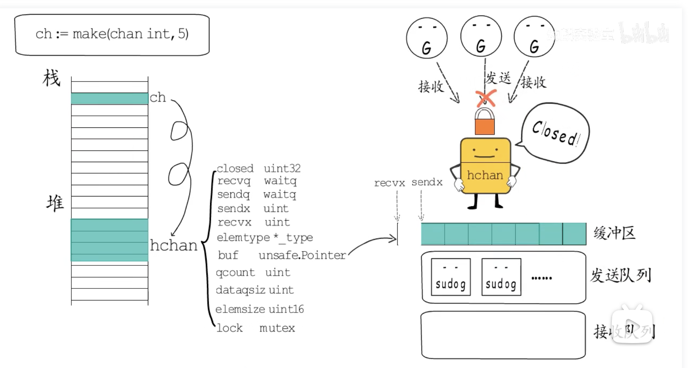

### mysql

SQL 优化
- 索引，针对一些业务查询比较慢的功能，对sql进行慢查询日志分析（explain），判断是否已使用索引，使用索引是否失效了，在索引这个方向上做sql优化
- 尽量不在事务中做查询操作，尽可能在事务前将数据查询出来，如果查询时间过长会导致事务持续时间长，影响业务进行
- select查询一条数据的时候使用limit 1
- 如果使用表关联join查询，注意关联字段使用索引，两个表的字符集保持一致，不然索引失效；小表驱动大表
- 注意where查询的范围，in查询数据不应该过多，条件中使用函数会索引失效
- update数据的时候添加order by排序
- insert尽量选择批量SQL插入，数据较多可多次提交事务

针对 SQL 语句如何建立索引（最左原则）
- 外键的字段一定要建立索引
- where经常查询的字段建立索引
- order by、group by、distinct的字段要建立索引
- 索引不包含有NULL值的列

索引数据结构（B+树）(innodb)

- B+树非叶子节点上是不存储数据的，仅存储键值
- B+树所有数据均存储在叶子节点

- 以主键作为B+树索引的键值就是聚集索引
- 以主键以外的列值作为键值构建的B+树索引就是非聚集索引，叶子节点上不保存数据，保存对应主键的ID


### redis

redis 的使用场景？
- 做数据缓存：比如用户信息
- 分布式锁：微信支付成功回调消息，给订单唯一标识订单号加锁
- 计数器：社区文章的点赞、浏览量，允许一定的延迟，读入redis再写入数据库
- - string、hash和sorted set都提供了incr方法用于原子性的自增操作
- 消息队列

内存不足有新数据缓存，redis 如何处理？
- Redis会检查内存使用，如果内存使用超过 maxmemory，就会按照置换策略删除一些 key
新的命令执行成功

redis 的淘汰策略
- lru 最近很少的使用的key（根据时间，最不常用的淘汰）
- - 随机采集淘汰的key，每次随机选出5个key（默认），然后淘汰这5个key中最少使用的key
- lfu 最近很少的使用的key (根据计数器，用的次数最少的key淘汰)
- random 随机淘汰
- ttl 快要过期的先淘汰

redis 的缓存一致性
- 事务机制，保证更新缓存和更新数据库是原子性的。
- 线程A删除缓存后未来得及更新数据，被线程B查询数据并写入缓存，使数据库数据和缓存数据不一致，解决办法是双删，延迟双删，线程A延迟时间大于线程B查询并写入缓存时间

### go

线上服务内存泄漏如何处理？OOM也就是Out of memory
- 系统结合系统整体负载情况，为程序分配内存oom_score，资源紧张的时候会选择合适的进行kill掉并回收内存资源，内存泄露大概率会kill掉进程，如果是因为oom就会记录到/proc/中查询，分析当前请求量大的业务，找出可能出现内存泄露的代码关键路径
- 使用top工具查看进程是否持续增加不能达到一个稳定值
- 借助go的 pprof 工具来排查


go 为啥使用 CSP 模型来实现并发？CSP就是通信顺序过程
- CSP的理念：以通信的方式来共享内存，即“不要通过共享内存来通信，而要通过通信来实现内存共享”，基于channel实现。

channel的数据结构
```
type hchan struct {
    qcount   uint           // 数组长度，即已有元素个数
    dataqsiz uint           // 数组容量，即可容纳元素个数
    buf      unsafe.Pointer // 数组地址
    elemsize uint16         // 元素大小
    closed   uint32			// 关闭状态
    elemtype *_type // 元素类型
    sendx    uint   // 下一次写下标位置
    recvx    uint   // 下一次读下标位置
    recvq    waitq  // 读等待队列
    sendq    waitq  // 写等待队列
    lock     mutex  // 锁
}

```

- lock 存在多个协程来抢锁的，为了安全，需要先抢锁才可以进行对channel进行读写
- buf 有缓冲区的channel需要找到缓存区在哪里
- qcount 知道已经存储了多少个元素
- dataqsiz 知道可以存储多少个元素
- elmsize 每个元素的大小
- elemtype 因为go运行时内存复制、垃圾回收等机制依赖数据类型，在channel中就需要知道有一个指针知道其数据类型
- sendx recvx channl可以进行交替的读和写，需要知道其读写位置的下标
- sendq recvq channel当不能立即进行读和写时，需要wait加入等待队列，等条件满足时，立即唤醒进行读和写
- close channel要能够关闭，记录其关闭状态



channel 是线程安全的吗？
- 是

channel 怎么保证的线程安全？
- channel结构中有lock锁，所以是线程安全的

mutex 是悲观锁还是乐观锁？
- 悲观锁
- 悲观锁：直接对该数据进行加锁以防止并发，避免同时被其他人修改
- 乐观锁：在数据进行提交更新的时候，才会正式对数据的冲突与否进行检测，如果冲突，则返回给用户异常信息，让用户决定如何去做。乐观锁适用于读多写少的场景，这样可以提高程序的吞吐量

mutex数据结构
```
type mute struct {
    state int32 // 互斥锁的状态，state=0未上锁
    sema unit32 // 用作信号量，主要用作等待队列
}
```
mutex有两种模式
- 正常模式：goroutine尝试加锁先**自旋**再**排队**，每一次解锁时，唤醒队列中第一个goroutine要跟其他正在自旋的goroutine抢锁（大概率唤醒的抢不过自旋的）；当队列中存在等待>=1ms后会切换饥饿模式进行抢锁
- 饥饿模式：遵循FIFO先进先出的规则抢锁，直到队列中不存在等待>=1ms的goroutine或只剩下一个再排队队列中就切换为正常模式


rwmutex 的使用场景，rwmutex也就是读写锁
- RWMutex在读锁占用的情况下，会阻止写，但不阻止读
- RWMutex在写锁占用情况下，会阻止任何其他goroutine（读和写）进来，整个锁相当于由该goroutine（协程）独占。


map 是线程安全的吗
- 不是

无锁，但是线程安全的 map 如何设计？（CAS）


结构体能否进行比较？

- 能比较的东西都是确定的，不能比较就是存在不确定性，比如slice、map、func存在指针，指针地址不一样。

```
golang中能够用 == 号直接比较的数据类型有如下
整型 integer、浮点型 float、字符串 string、布尔型 boolean、复数型 complex、指针型 pointer、通道型 channel、接口型 interface、数组型 array
不能直接比较的
切片型 slice、键值对型 map、函数型 func
空结构体的使用场景
```
给 channel 用空结构体的好处是什么？

- 空结构体，仅作为占位符，不占用内存

字符串转 byte 数组会发生内存拷贝吗？

- 发生类型强转都会发生内存拷贝

字符串转 byte 数组，如何避免发送内存拷贝？
- 使用unsafe包可强制转换指针地址

```
string的结构
type stringStruct struct {
    str unsafe.Pointer
    len int
}
slice的结构
type slice struct {
    array unsafe.Pointer
    len   int
    cap   int
}
```

多核 CPU 如何保持 cache 一致？（MESI协议）

GMP 调度模型，GMP 中的抢占机制

GC 三色标记，stw 是什么意思？产生 stw 的原因是什么？小对象多了，为什么会造成 GC 压力？

#### 代码题

go 函数中，返回值未命名，发生了 panic，但是在函数内 recover 了，函数返回什么值？怎么解决？

```

func test() error {
	var err error
	defer func() {
		if r := recover(); r != nil {
			err = errors.New(fmt.Sprintf("%s", r))
		}
	}()
	raisePanic()
	return err
}
func raisePanic() {
	panic("发生了错误")
}

```
以下是我的修改，要是兄弟们有其他解决方法请评论留言，欢迎交流学习

```
func test() error {
	var err error
	defer func() {
		if r := recover(); r != nil {
			err = errors.New(fmt.Sprintf("%s", r))
		}
	}()
	err = raisePanic()
	return err
}
func raisePanic() (err error) {
	defer func() {
		if r := recover(); r != nil {
			err = errors.New(fmt.Sprintf("raisePanic函数异常：%s", r))
		}
	}()
	panic("发生了错误")
}
```


打印值是多少？

```

func unit_test() {
	var a uint = 0
	var b uint = 1
	c := a - b
	fmt.Println(reflect.TypeOf(c)) //unit
	fmt.Println(c)                 //2^64 - 1，如果是32位的系统难受2^32-1
}

```

```

func range_1() {
	a := [3]int{1, 2, 3} // 数组
	for k, v := range a {
		if k == 0 {
			a[0], a[1] = 100, 200
			fmt.Println(a) //打印100，200，3
		}
		a[k] = 100 + v
		//因为a是数组，for循环时进行值复制，使用不改变循环v的值
		//当k=0，a[0] = 100 + 1
		//当k=1，a[1] = 100 + 2
		//当k=2，a[2] = 100 + 3
	}
	fmt.Println(a) //打印101，102，103
}
```

```

func range_2() {
	a := []int{1, 2, 3} // 切片
	for k, v := range a {
		if k == 0 {
			a[0], a[1] = 100, 200
			fmt.Println(a) //打印100，200，3
		}
		a[k] = 100 + v
		//当k=0，a[0] = 100 + 1
		//当k=1，a[1] = 100 + 200
		//当k=2，a[2] = 100 + 3
	}
	fmt.Println(a) //1，2，3
}
```

每个函数起一个 goroutine，轮流打印 cat、dog、fish 100 次
```
package interview

import (
	"fmt"
	"sync"
	"sync/atomic"
	"testing"
)

var i int64 = 1   //当前打印次数
var j int64 = 100 //打印次数
var mySync sync.WaitGroup

func TestChannel(t *testing.T) {
	mySync.Add(1)
	var dogChan = make(chan string, 0)
	var catChan = make(chan string, 0)
	var fishChan = make(chan string, 0)
	go dogChanF(dogChan, catChan)
	go catChanF(catChan, fishChan)
	go fishChanF(fishChan, dogChan)
	dogChan <- "dog"
	mySync.Wait()
}

func dogChanF(dogChan, catChan chan string) {
	for {
		if dog, ok := <-dogChan; ok {
			fmt.Println(dog)
			catChan <- "cat"
		} else {
			return
		}
	}
}

func catChanF(catChan, fishChan chan string) {
	for {
		if cat, ok := <-catChan; ok {
			fmt.Println(cat)
			fishChan <- "fish"
		} else {
			return
		}
	}
}

func fishChanF(fishChan, dogChan chan string) {
	for {
		if fish, ok := <-fishChan; ok {
			fmt.Println(fish)
			atomic.AddInt64(&i, 1)
			if i > j {
				mySync.Done()
			}
			dogChan <- "dog"
		} else {
			return
		}
	}
}


```

手写 LRU 算法

网络编程

tcp 三次握手，四次挥手，四次挥手中 time_wait 可怕还是 close_wait 可怕


用过哪些 Linux 命令
- scp,cp,ls,whereis,cat,grep,find


tcp 的流量控制

rpc 是什么？如何设计一个 rpc？
- RPC 远程过程调用
- RPC走socket，保持连接状态，HTTP需要三次握手四次挥手。
- RPC一般有注册中心
- RPC协议内容更少更简单，HTTP还需要很多而外的东西，比如请求头

相比于http网络消耗更少，调用更快，效率更高


如何处理 tcp 粘包问题？

http1.1 和 http2 的区别
相比http1.1，http2支持以下内容
- 多路复用（multiplexing）:多路复用通过多个请求stream共享一个tcp连接的方式
- 服务器推送:客户端请求test.css,服务端返回时可一并把test.js返回，下次访问直接从缓存取