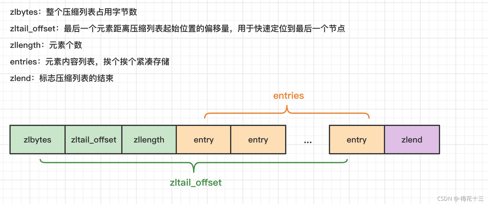
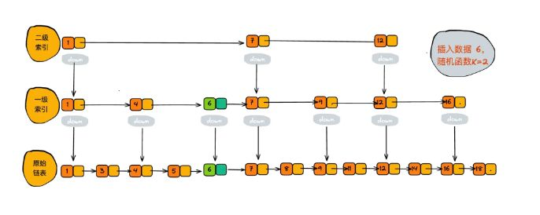

### 5种数据类型：
- 字符串
- 列表
- 哈希
- 集合
- 有序集合

#### redisObject
类型
内部编码
LRU时间
引用计数
*数据指针

### 字符串：
底层三种编码
数字就是int
字符串<44字符（B）就是emnstr
字符串>44字符就是raw
最大512M

#### SDS与slice的区别：

- 字段：
sds是未使用容量和已使用长度
slice是已使用长度和总长度

- 字段类型：
sds只是字符串；slice可是任意类型；

- 扩容方式
sds的长度是<1M就未使用容量和已使用长度相等；>1M就未使用容量是1M
slice扩容如果长度<1024则扩容为原来的2倍，>1024则为原来的1.25倍

共同：
减少向内核系统申请分配内存和释放内存
两者求取长度的复杂度都是O(1)
两者求取容量的复杂度也是O(1）
两者扩容时都采用了于扩容的策略，避免频繁申请内存
两者缩容时也都不会立刻释放多余的内存

### List
参考：https://blog.csdn.net/w15558056319/article/details/121223706

2^32-1个有序元素
3.2版本redis之前使用
压缩列表：ziplist
链接列表：linklist
3.2版本后使用快速列表：quicklist，实际上是混合列表，包括ziplist和linklist

#### 压缩列表
相当于一段连续的数组存储数据；但每个元素长度不一样

压缩列表的数据结构
- zlbytes：整个压缩列表的字节数
- zllength：元素个数
- zltail_offset：从头到尾的元素偏移量
- entry：元素内容
- zlend：压缩列表结束标志

连续内存存储的不利于插入、删除数据；查询速度快；
扩容需要调用realloc 扩展内存；元素数量很长是拷贝需要花费很长时间

#### 链接列表
带双向链表的数据
- item：当前节点的数据
- prev：前一个节点的地址
- next：后一个节点的地址

插入、删除数据快，但保存前后地址指针内存开销过大。
地址不连续，容易产生内存碎片化

#### 快速列表
每一个节点quicknode一个压缩列表；节点间通过双向链接连接，就是链接列表
内部默认单个 ziplist 长度为 8k 字节，超出了这个字节数，就会新起一个ziplist。

### hash
参考：https://blog.csdn.net/chongfa2008/article/details/119537064
两种实现方式
- ziplist压缩列表作为底层实现
- hashtable哈希对象作为底层实现

当键值和值字符串长度都<64字节（B）,还有保存的键值对数量<512个才选择使用压缩列表来存储；不然会转换为哈希对象存储

### set
由哈希表或整数集合实现；哈希表解析如上
整数集合本质上是一块连续内存空间，它的结构定义如下：
- 编码结构：int16、int32、int64
- 元素数量
- 保存的元素数组

原来3个数为int16，插入int32，存在int16向int32整体升级的操作，为的是节省内存资源；

### zset
有序集合
- 压缩列表
- 跳跃列表

当元素数量<128并且每个元素字符串长度<64字节则使用压缩列表

跳跃列表在一个双向链表的基础上添加一级索引、二级索引、三级索引；
时间复杂度都是 O(logn)、空间复杂度 O(n)
